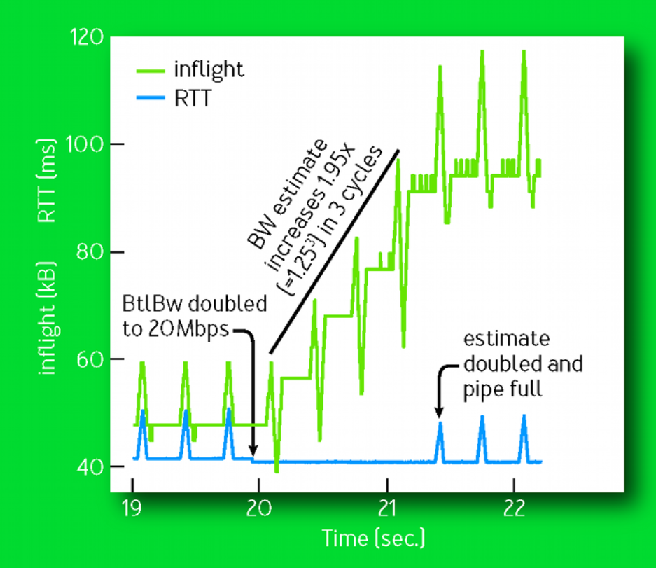

# Documentation for checkpoint3 

## Question 1 : profile your Reno implementation

In checkpoint 3, we choose Data Center scenario to analyze the performance and drawbacks of the Reno.

### Question1.2	 Consider Reno’s design: what makes it slower than it could be? 

In the well-known essay “*BBR: Congestion-Based Congestion Control*”，author described the detailed reasons of why loss-based congestion control are not suitable for the network nowadays. The analysis are as follows:

problems result from a design choice made when TCP congestion control was created in the 1980s—interpreting packet loss as "congestion." This equivalence was true at the time but was because of technology limitations, not first principles. As network interface controllers evolved from Mbps to Gbps and memory chips from KB to GB, the relationship between packet loss and congestion became more tenuous.

Today TCP's loss-based congestion control—even with the current best of breed, CUBIC—is the primary cause of these problems. When bottleneck buffers are large, loss-based congestion control keeps them full, causing bufferbloat. When bottleneck buffers are small, loss-based congestion control misinterprets loss as a signal of congestion, leading to low throughput. Fixing these problems requires an alternative to loss-based congestion control. 

But first, let us introduce some basic concepts of where and how network congestion originates. As we know, TCP connection has exactly one bottleneck which determines the connection's maximum data-delivery rate and easily forms persistent queues. Regardless of how many links a connection traverses or what their individual speeds are, from TCP's viewpoint an arbitrarily complex path behaves as a single link with the same RTT and bottleneck rate. Two physical constraints, $RTprop$ (round-trip propagation time) and $BtlBw$ (bottleneck bandwidth), bound transport performance.

This figure shows RTT and delivery rate variation with the amount of data in flight (data sent but not yet acknowledged). Blue lines show the $RTprop $constraint, green lines the $BtlBw$ constraint, and red lines the bottleneck buffer. Operation in the shaded regions isn't possible since it would violate at least one constraint. Transitions between constraints result in three different regions (app-limited, bandwidth-limited, and buffer-limited) with qualitatively different behavior.


When there isn't enough data in flight to fill the pipe,$ RTprop$ determines behavior; otherwise, $BtlBw $dominates. Constraint lines intersect at $inflight = BtlBw× RTprop$, a.k.a. the pipe's BDP (bandwidth-delay product). Since the pipe is full past this point, the inflight - BDP excess creates a queue at the bottleneck, which results in the linear dependence of RTT on inflight data shown in the upper graph. Packets are dropped when the excess exceeds the buffer capacity. Congestion is just sustained operation to the right of the BDP line, and congestion control is some scheme to bound how far to the right a connection operates on average.

Loss-based congestion control operates at the right edge of the bandwidth-limited region, delivering full bottleneck bandwidth at the cost of high delay and frequent packet loss. When memory was expensive buffer sizes were only slightly larger than the BDP, which minimized loss-based congestion control's excess delay. Subsequent memory price decreases resulted in buffers orders of magnitude larger than ISP link BDPs, and the resulting bufferbloat yielded RTTs of seconds instead of milliseconds.

The left edge of the bandwidth-limited region is a better operating point than the right. These result in a distributed congestion-control protocol that reacts to actual congestion, not packet loss or transient queue delay, and converges with high probability to optimal operating point. BBR did this jobs with a high performance and easy deployment.

## Question 2 : Our new CCA

### Question2.1	Describe your new algorithm to someone else who needs to implement it too. How does it work? What is the ‘state machine’ to update your new algorithm?

 The core codes are as follows:

```c
function onAck(packet)
	rtt = now - packet.sendtime
    update_min_filter(RTpropFilter, rtt)
    delivered += packet.size
    delivered_time = now
	deliveryRate = (delivered - packet.delivered) / (delivered_time - packet.delivered_time)
	if (deliveryRate > BtlBwFilter.currentMax || ! packet.app_limited)
        update_max_filter(BtlBwFilter, deliveryRate)
    if (app_limited_until > 0)
       	app_limited_until = app_limited_until - packet.size

```

```c
function send(packet)
	bdp = BtlBwFilter.currentMax × RTpropFilter.currentMin
    if (inflight >= cwnd_gain × bdp)
    // wait for ack or retransmission timeout
    return
    if (now >= nextSendTime)
        packet = nextPacketToSend()
    if (! packet)
        app_limited_until = inflight
        return
    packet.app_limited = (app_limited_until > 0)
    packet.sendtime = now
    packet.delivered = delivered
    packet.delivered_time = delivered_time
    ship(packet)
    nextSendTime = now + packet.size / (pacing_gain × BtlBwFilter.currentMax)
timerCallbackAt(send, nextSendTime)

```

​	$BtlBw$ and $RTprop$ vary over the life of a connection, so they must be continuously estimated. TCP currently tracks RTT (the time interval from sending a data packet until it is acknowledged) since it's required for loss detection. At any time $t$,
$$
RTT_t=RTprop_t+\eta_t
$$
where $\eta\ge 0$ represents the "noise" introduced by queues along the path, the receiver's delayed ack strategy, ack aggregation, etc. $RTprop$ is a physical property of the connection's path and changes only when the path changes. Since path changes happen on time scales $\gg RTprop$, an unbiased, efficient estimator at time $T$ is
$$
\widehat{RTprop} = RTprop +min(\eta_t)=min(RTT_t) \forall t \in [T-W_R,T]
$$
(i.e., a running min over time window $W_R$ (which is typically tens of seconds to minutes).

​	Unlike RTT, nothing in the TCP spec requires implementations to track bottleneck bandwidth, but a good estimate results from tracking delivery rate. When the ack for some packet arrives back at the sender, it conveys that packet's RTT and announces the delivery of data inflight when that packet departed. Average delivery rate between send and ack is the ratio of data delivered to time elapsed: $deliveryRate =\Delta delivered/\Delta t$. This rate must be $\leq$ the bottleneck rate (the arrival amount is known exactly so all the uncertainty is in the *Δt*, which must be $\ge$ the true arrival interval; thus, the ratio must be $\leq$ the true delivery rate, which is, in turn, upper-bounded by the bottleneck capacity). Therefore, a windowed-max of delivery rate is an efficient, unbiased estimator of $BtlBw$:
$$
\widehat{BtlBw} = max(deliveryRate_t) \forall t \in [T-W_R,T]
$$
where the time window $W_B$ is typically six to ten RTTs.

​	TCP must record the departure time of each packet to compute RTT. BBR augments that record with the total data delivered so each ack arrival yields both an RTT and a delivery rate measurement that the filters convert to $RTprop$ and $BtlBw$ estimates. And this is what we did in the function $onAck()$.

​	When sending data,to match the packet-arrival rate to the bottleneck link's departure rate, BBR paces every data packet. Pacing_rate is BBR's primary control parameter. A secondary parameter, $cwnd_gain$, bounds inflight to a small multiple of the BDP to handle common network and receiver pathologies. In order to make the filters control adaptation in addition to estimating the bottleneck constraints, it creates the novel control loop shown in the figure followed. The triangular structures result from BBR cycling pacing_gain to determine if $BtlBw $has increased. The gain used for each part of the cycle is shown time-aligned with the data it influenced. The gain is applied an RTT earlier, when the data is sent.


​	BBR minimizes delay by spending most of its time with one BDP in flight, paced at the $BtlBw$ estimate. This moves the bottleneck to the sender so it can't observe $BtlBw$ increases. Consequently, BBR periodically spends an $RTprop $interval at a pacing_gain > 1, which increases the sending rate and inflight. If $BtlBw$ hasn't changed, then a queue is created at the bottleneck, increasing RTT, which keeps deliveryRate constant. (This queue is removed by sending at a compensating pacing_gain < 1 for the next $RTprop$.) If $BtlBw$ has increased, deliveryRate increases and the new max immediately increases the $BtlBw$ filter output, increasing the base pacing rate. Thus, BBR converges to the new bottleneck rate exponentially fast.



​	In order to reach the proper sending rate, most of the time is spent in the $ProbeBW$ state. The Startup and Drain states are used at connection start . To handle Internet link bandwidths spanning 12 orders of magnitude(in this scenario, max bandwidth reach to 5 gigabits per second), Startup implements a binary search for $BtlBw$ by using a gain of 2/ln2 to double the sending rate while delivery rate is increasing. This discovers $BtlBw$ in *log2BDP* RTTs but creates up to *2BDP* excess queue in the process. Once Startup finds $BtlBw$, BBR transitions to Drain*,* which uses the inverse of Startup's gain to get rid of the excess queue, then to $ProbeBW$ once the inflight drops to a BDP.


​	BBR flows cooperate to periodically drain the bottleneck queue using a state called $ProbeRTT$. In any state other than $ProbeRTT$ itself, if the $RTprop$ estimate has not been updated (i.e., by getting a lower RTT measurement) for more than 10 seconds, then BBR enters $ProbeRTT$ and reduces the $cwnd$ to a very small value (four packets). After maintaining this minimum number of packets in flight for at least 200 ms and one round trip, BBR leaves $ProbeRTT$ and transitions to either Startup or $ProbeBW$, depending on whether it estimates the pipe was filled already.

​	This is very important to the situation when the bandwidth in bottleneck drops. As we can see in the figure followed, when $BtlBw$ halved, too many inflight will fill buffer quickly and increase RTT a lot, both $BtlBw$ and $RTprop$ will never update. To avoidance this situation, timely and mandatory update $RTprop$ seems an easy way to escape from it.


​	BBR was designed to spend the vast majority of its time (about 98 percent) in $ProbeBW$ and the rest in $ProbeRTT$, based on a set of tradeoffs. $ProbeRTT$ lasts long enough (at least 200 ms) to allow flows with different RTTs to have overlapping $ProbeRTT$ states, while still being short enough to bound the performance penalty of $ProbeRTT$'s $cwnd$ capping to roughly 2 percent (200 ms/10 seconds). The $RTprop$ filter window (10 seconds) is short enough to allow quick convergence if traffic levels or routes change, but long enough so that applications often have natural silences or low-rate periods within the window where the flow's rate is low enough or long enough to drain its queue in the bottleneck. Then the $RTprop$ filter opportunistically picks up these $RTprop$ measurements, and $RTProp$ refreshes without requiring $ProbeRTT$. This way, flows typically need only pay the 2 percent penalty if there are multiple bulk flows busy sending over the entire $RTProp$ window.

​	Therefore, the "state machine" will be totally different:


### Question2.2	How long does it take for your new CCA to transfer a 20MB file? How long does it take your Reno implementation? 

About 15s in out own Reno implementation.

### Question2.3	What is different about your new CCA that makes it perform better than Reno in transferring 20MB files?

​	We have already explained the reasons why BBR algorithm perform much better than TCP's loss-based congestion control. In fact, the former can make transition adapt to the current bottleneck much more quickly than tradition one(AIMD principle). Secondly,  in stead of sending $cwnd$ Packets once time (it will increase queueing length in a short time), BBR algorithm set a proper send pacing rate (
$$
packet.size / (pacing\_gain × BtlBwFilter.currentMax)
$$
) in the client to reduce congestion in buffer. Moreover, it decreases the queueing delay which is important to Data Center. As we can see, long queueing delay in the buffer will causes lots of unnecessary retransmits and waste bandwidth. What’s worse, traditional CC have a slower response to congestion that might will lead to a long persistent queue or even packet loss. Last of all, BBR avoids lot of bufferbloat condition, thus improving the throughput a lot.

### Question2.4	How long does it take for your new CCA to transfer a 3MB file? How long does it take your Reno implementation? 

 About 3s in our own implementation.

### Question2.5	Explain why one algorithm performs better than the other, or why they perform equally. 	

​	We can see, when the transferred file size is tiny, BBR don’t have an giant improvement in the performance. That consequence partly results from BBR will converges to the new bottleneck rate exponentially fast, which is similar to slow-start. Owing to small file size, it causes short persistent queue and less bufferbloat when using Reno. However, BBR still perform better than Reno according to reasons we have already discussed. First, BBR is more robust in discovering available bandwidth, since it does not exit the search upon packet loss and have lower delay. Second, BBR smoothly accelerates its sending rate, while within every round Reno sends a burst of packets and then imposes a gap of silence and increases queueing delay. 