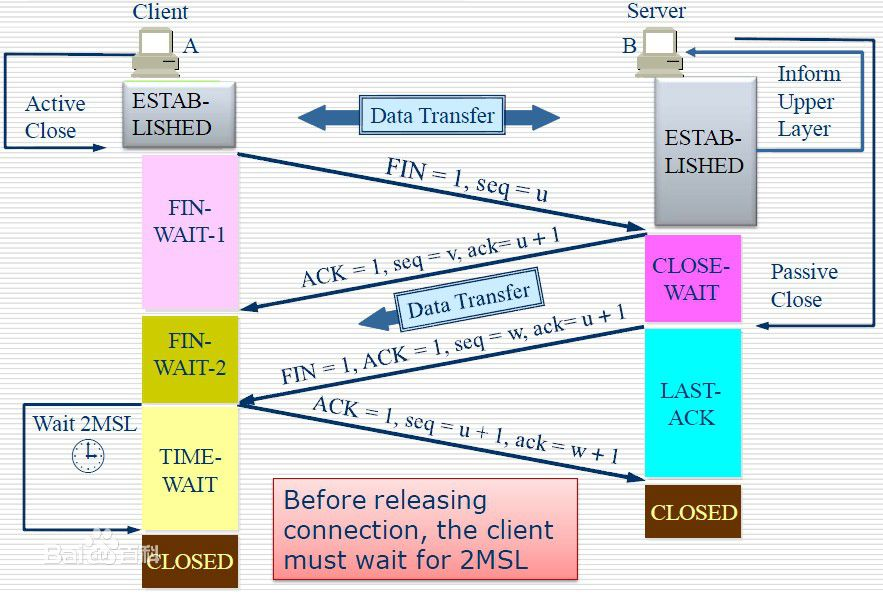
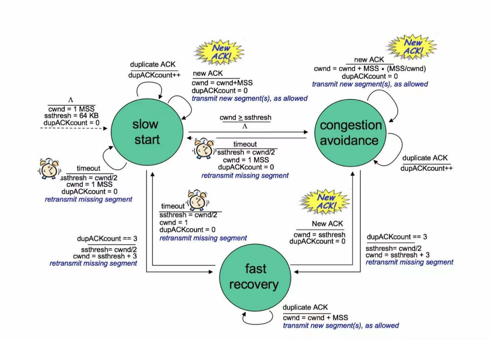
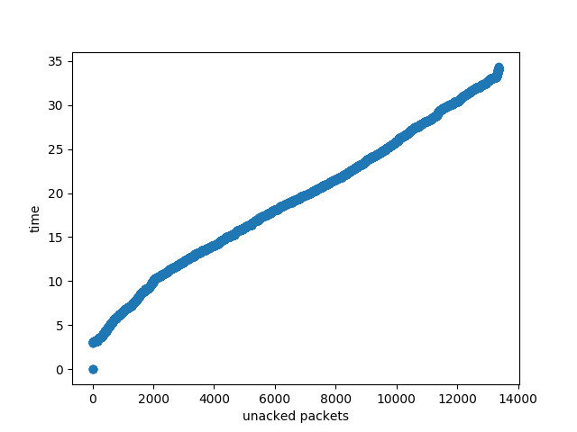

# Project Documentation : TCP Reno

## 成员说明

- 17302010063 黄佳妮 sliding window,retransimission,flow control of cp1 and cp2, also coordinating between team members
- 17302010029 卢永强 4-way handwaving and self-defined cca research in cp3
- 17302010018 周钰承 rto calculation and self-defined cca research in cp3
- 17302010051 杨辉 3-way handshaking and congestion control of cp1 and cp2

*To make our explanation understandable, we will just explain our design in Chinese*

## 模块说明

### TCP三次握手实现
#### TCP握手过程
* 第一次握手
客户端(TCP连接发起方)向客户端发送一个特殊的报文段，该报文段中首部的SYN比特被置为1表示这是一个用于建立连接(即握手过程)的报文段。另外客户端还会随机选择一个初始序号，并将此编号置于该报文段的序号字段中。
* 第二次握手
客户端发送的SYN报文段到达服务器后，服务器提取SYN报文段，为该TCP连接分配缓存和变量，然后向客户端发送允许连接的报文。该报文段的SYN同样被置为1，确认号字段置为client_isn+1(client_isn即客户端发送的报文段的初始序号),同样服务器也随机选择一个初始序号(server_isn)置于报完段首部中。该允许连接的报文段称为SYNACK报文段。
* 第三次握手
客户端受到SYNACK报文段后，客户端也为该连接分配缓存和变量。然后向服务器发送最后一个确认报文段，客户端通过将sever_isn置于报文段的确认字段中来实现确认。因为连接已经建立，SYN被置为0，并且报文段可以包含数据。

#### 握手实现
* 用状态量来表示当前握手处于哪一阶段，通过维护一个状态机来实现TCP的握手过程
* 用于握手的状态常量如下(其余状态量将用于数据传输过程和四次挥手过程)
    * #define STATUS_SYN_SENT 1
    * #define STATUS_ESTABLISHED 2
    * #define STATUS_LISTEN 6
    * #define STATUS_SYN_RCVD 7
* 具体实现为两个函数，分别为客户端和服务器端的握手实现
    int fdu_initiator_connect(cmu_socket_t *dst);
    int fdu_listener_connect(cmu_socket_t *dst);
    两个函数都调用void check_for_data(cmu_socket_t *sock, int flags);函数，来对收到的报文段进行处理，根据当前的状态dst->status，以及收到的报文段的FLAG来对status进行维护握手过程(包括数据传输和挥手的过程)

### TCP四次挥手实现

​        TCP为全双工连接，必须从client和server两端单独进行关闭，下方图片展示了从客户端主动发起挥手关闭tcp连接的过程。



**实现过程中主要实现的状态标识释义：**

STATUS ESTABLISHED: 无论client端还是server端在握手建立起来之后的稳定状态，也即挥手过程所基于的初始状态；

STATUS FIN WAIT 1：挥手发起方在发送FIN包后所进入的状态，此时等待被动方的ACK pkt，等不到则循环发送FIN包；

STATUS FIN WAIT 2： 挥手发起方在接收到被动方传送的ACK pkt后进入此状态，等待被动方发送FIN，同时仍可接收数据；

STATUS CLOSE WAIT： 挥手被动方接收到FIN包后进入此状态，此时仍可发送数据；

STATUS LAST ACK： 挥手被动方在发送出FIN包后进入此状态，意为等待接收发起方发出的确认ACK；

STATUS TIME WAIT： 挥手发起方在接收到FIN包并发出ACK后转入此状态，此后持续发送ACK，并记录时间，当时长到达2MSL后断开连接；

STATUS CLOSED： 挥手发起方和被动方在完成四次挥手动作后断开连接，进入此状态。

**四次挥手过程简述（以client主动发起为例）：**

​      client没有数据传输和其他需要时，向server主动发起一个FIN pkt，并且是循环发送，状态转入STATUS FIN WAIT 1，而server在收到FIN后也由原来的STATUS ESTABLISHED转入STATUS CLOSE WAIT，并且回复一个ACK，client在收到这个ack后转入STATUS FIN WAIT 2，此后如果server尚有数据需要发送，仍可继续，client也会接收，并会回复ack。而后当server传输完成后即可发送FIN断开，状态转入STATUS LAST ACK，此时client接收到FIN，随即转入STATUS TIME WAIT，并回复ack，在等待2MSL后自行断开连接，转入STATUS CLOSED，server在接收到ack后状态也会转为STATUS CLOSED，超时断开。

在server主动发起挥手时的实现如下：

​        首先，server进入第一个拥塞，向 client循环发送FIN pkt，等待client接收到FIN并回复ack后，跳出第一个拥塞状态，进入第二个等待client发送的FIN的拥塞，直到接收到这个FIN后，进入正常的四次挥手状态。

​       本设计中挥手的实现，除了部分handle_message()中对于FIN包的检测之外，基本独立于chech_for_data()和handle_message()两个函数，以cmu_close()、fdu_initiator_disconnect()、fdu_listener_disconnect()三个函数为主体，实现了线程关闭（close_backend()）和内存资源释放（free_cmu_socket()），自主实现ack的限时检测、等待FIN包接收等函数。

### TCP流量控制实现

#### 从停等协议到滑窗协议

在global.h头文件的window结构体中，增加发送窗口与接收窗口结构体的维护。其中，发送窗口的滑动大体由两个变量维护，即在整个数据流中“划分是否被确认”和“划分是否已发送”的sendbase和nextseqnum，都以字节为单位。


#### rwnd变量添加

如果说拥塞控制是对网络情况不加（出现重传情况）的处理，那么流量控制就是更加一般的传输速率控制。发送窗口通过接收到ack包中的头部字段adv_win（以设置为自己的rwnd）来确认接收窗口的可用buf大小，从而动态调整一次最多发送的包的数量。

值得注意的是当rwnd=0的特殊处理。如果不作任何处理，发送窗口将不发送任何数据包给接收窗口，因为此时接收窗口无法接收更多的包。但当上层应用读取数据后并且已经动态更新接收窗口可用buf大小后，由于接收窗口将不会发送任何包给发送窗口（没有收到数据包因此不会回复ack），将会形成互相等待的死锁局面。

因此，当发送方rwnd=0时，仍然需要持续不断地向接收方发送数据长度为1的包，从而避免死锁的产生。


### TCP拥塞控制实现

#### 拥塞控制原理
与流量控制的目的相同，拥塞控制也是为了实现限制发送方的发送速率来减少无效数据报的发送，以提高网络传输效率的策略。
#### 实现方法
通过在发送端的窗口中添加cwnd、ssthresh变量，以及congestion_status变量，维护一个有关拥塞控制的状态机来实现。
状态机的三个状态如下:
* #define SLOW_START 0
* #define CONGESTION_AVOIDANCE 1
* #define FAST_RECOVERY 2
##### 慢启动(slow start)
cwnd从初始值1 MSS(设置为500字节)开始，当新的ACK确认时，增加1 MSS。
* 当出现timeout时，令ssthresh=cwnd/2(初始为64k-1即65535)，并开始下一次slow start。
* 当cwnd>= ssthreshshi时，转移到拥塞避免状态(即设置变量congestion_status为SLOW_START)
* 当冗余ACK(在实现快速重传中已经实现)达到3个时，转移到快速恢复状态
##### 拥塞避免(congestion avoidance)
在该状态下，每当新的ACK确认时，cwnd只增加 MSS*(MSS/cwnd)
* 当出现timeout时，令ssthresh=cwnd/2，cwnd=MSS，转移到慢启动状态
* 当冗余ACK达到3个时，令ssthresh=cwnd/2，cwnd=ssthresh+3*MSS,转移到快速恢复状态
##### 快速恢复(fast recovery)
在该状态下，每次收到冗余ACK且计数不大于3，cwnd+=MSS
* 当冗余ACK达到3个或者timeout时，令ssthresh=cwnd/2，cwnd=MSS，转移到慢启动状态
* 确认一个新的ACK时，cwnd=ssthresh，转移到拥塞控制状态




### RTO Estimation

​	本次lab中，实现了 Jacobson/Karels Algorithm。在"Congestion Avoidance and Control"一文中，我们可以详细地了解到Van Jacobson认为，相较于旧算法粗糙的将RTT指数加权移动平均(EWMA)后再乘以一个系数$\beta$ 来得到RTO，新算法还计算了一个RTT的方差，并通过$RTO=EstimatedRTT+4*DevRTT$来计算得到一个较为精准的RTO数值。此外，相较于时间复杂度高的方差计算，论文中推荐使用RTT的算数平均偏差值mdev来进行一个替代。以下为具体的算法，其中m为RTT时间，Err为误差，a为EstimatedRTT，v为DevRTT。
$$
Err\equiv m−a \\
a \leftarrow a+gErr\\
v\leftarrow v+g(|Err|−v)\\
rto\leftarrow a+4*v
$$
​	论文中推荐g值为0.125不仅方便了位移运算，而且还能模拟出较优的RTO解。

​	伪代码实现如下：

```c
/*update Average estimator */
m −= (sa >> 3);
sa += m;
/* update Deviation estimator */
if (m < 0)
m = −m;
m −= (sv >> 3);
sv += m;
m −= (sa >> 3);
sa += m;
if (m < 0)
m = −m;
m −= (sv >> 2);
sv += m;
rto = (sa >> 3) + sv;
```

​	上述所有的值都将在cmu_tcpcb这一结构体中被维护，每次收到一个ack包后，都将利用ack包中的时间戳，通过tcp_xmit_timer()这一个函数来获得该包的RTT，并且更新RTO时间。


## 结果分析




